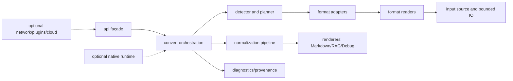

# MoonBit MarkItDown 项目维护与演进计划

**文档状态：** 已接受；Phase 0-1.6 已实施，作为 Phase 2-6 工作基线
**版本：** 1.0  
**编制日期：** 2026-08-05  
**适用范围：** `ZSeanYves/markitdown` 主模块、CLI、格式读取器、转换管线、native FFI、质量实验室、发布物和外部依赖

## 1. 执行摘要

本项目不是 Python MarkItDown 的逐行移植，而是以其用户可观察行为为兼容目标、以 MoonBit 的类型系统、原生编译和跨目标能力为实现基础的独立产品。长期目标是：

1. 对官方 MarkItDown 的核心文档抽取行为保持可验证的兼容性；
2. 在 macOS 和 Linux 上提供可安装、可复现、无需 Python 运行时的 native 产品；
3. 在语义等价、相同输入和相同输出约束下，性能稳定优于官方 Python 实现；
4. 把不适合放在核心包的网络、云服务、外部命令和实验性能力隔离成显式可选扩展；
5. 将通用、安全边界明确、拥有独立生命周期的本地实现逐步提取为独立 MoonBit 库，经过双跑和版本化后再回导；
6. 在 0.8 允许一次集中式破坏性重整，0.9 冻结兼容面，1.0 起遵守明确的 SemVer、弃用和安全支持政策。

当前判断不是“代码不能用”，而是“代码已经足够大，必须先治理边界再继续加格式”。Phase 0 记录了 106 个 MoonBit 包、506 个 `.mbt` 文件和约 1,900 个公开声明；Phase 1 重整过程一度达到 108 包。当前基线已经收敛为 68 包、509 个 `.mbt` 文件、1,871 个公开声明和 9,878 行生成接口。公开面、依赖面、格式契约、文档和性能证据均已成为自动化门禁，不能再依赖维护者记忆。

### 1.1 立即结论

| 决策 | 结论 |
| --- | --- |
| 稳定入口 | 收敛到一个小型 `api`/根 façade；内部格式包不再被视为稳定 API |
| 目标平台 | 1.0 Tier 1 为 Linux x86_64、macOS arm64；Linux arm64、macOS x86_64 为 Tier 2，证据不足时不承诺 |
| 核心运行时 | 同步、无网络、无 Python、默认无外部命令；native 为正式发行目标 |
| async | 只在可选 runtime 适配层使用；稳定 API 不泄露实验性 async 类型 |
| 网络/插件/云 | 不进入核心；单独扩展包，默认关闭并有 SSRF、凭证和资源限制 |
| ZIP | 优先提取为独立安全库；本地 ZIP 安全策略仍由本项目控制 |
| XML/OOXML/PDF | 先建立独立边界和契约，再决定提取；没有成熟可信替代前继续自有实现 |
| Markdown/YAML | 暂不因下载量替换；必须先过规范套件、输出差分和性能测试 |
| 官方基线 | 固定 MarkItDown `v0.1.7`；`main` 仅作前瞻观察，不能混入正式回归门禁 |
| 版本路线 | 0.8 架构/API 重整，0.9 RC，1.0 稳定发布 |

## 2. 范围、原则与兼容定义

### 2.1 范围

计划覆盖源代码、包结构、公共 API、格式支持、解析和渲染契约、C FFI、CLI、测试夹具、基准、依赖、许可证、文档、发布物、维护角色和上游跟踪。它不承诺把官方 MarkItDown 的所有网络站点、云服务和 Python 插件迁移到核心。

### 2.2 不可妥协原则

- **先定义行为，再选实现。** 官方实现是兼容参照，不是架构模板。
- **安全默认值优先。** 不访问网络、不执行外部程序、不读取超出输入范围的资源，除非调用者显式启用扩展。
- **性能主张必须可复现。** 任何“更快”都必须有固定版本、固定数据、固定构建模式和公开脚本。
- **跨平台要按能力声明。** “能被 MoonBit 检查”不等于“能作为发行物运行”。
- **依赖是供应链，不是代码片段。** 下载量不能替代 API 稳定性、许可证、维护者响应、模糊测试和基准证据。
- **破坏性变更集中完成。** 0.8 进行结构和公共面的收敛，1.0 后通过弃用期而不是随意改名。
- **生成文件可审计。** `.mbti`、黄金输出和 SBOM 必须能由固定命令重建；手工修改生成物禁止合入。

### 2.3 三层兼容定义

不能以“Python API 名称完全相同”作为 MoonBit 的唯一兼容标准。兼容性分三层：

1. **表面兼容（surface）：** 输入种类、CLI 选项、格式识别、输出模式、错误类别和能力探测可映射；
2. **语义兼容（semantic）：** 标题、段落、列表、表格、链接、图片/附件、代码块、顺序、编码和不可解析内容的处理符合固定契约；
3. **运行兼容（operational）：** Path/Text/Bytes/Reader 等输入、stdin/stdout、hint、资源上限、退出码和“默认不联网”行为稳定。

逐字 Markdown 相等只对明确要求的确定性场景使用；其余场景用规范化 AST、结构化字段和语义断言比较，项目自身增加的 provenance、diagnostic、source map 必须单独记录，不能因附加能力误判为不兼容。

## 3. 当前基线与问题清单

### 3.1 已验证基线（2026-08-07）

| 命令/证据 | 结果 | 解释 |
| --- | --- | --- |
| `moon fmt --check` | 通过，578 tasks | 格式可复现 |
| `moon check --target all --warn-list +73 --deny-warn` | 通过，各目标无警告 | 语义核心可跨目标检查 |
| `moon test --target all` | C native 907/907，JS/Wasm/Wasm-GC 各 481/481 | 完整 `MOONBIT_NEW_NATIVE=1` native 907/907，macOS/Linux 阻断式 CI 均通过 |
| 现有 CI | native macOS/Linux、全目标 check/test、覆盖率、回归和部分性能门禁 | 需要补齐 native 全量链接、sanitizer、发布和依赖漂移门禁 |
| 官方性能证据 | Apple M4/macOS arm64 完整重跑 25 个可比案例；CLI 行中位数 63.941 ms，MarkItDown 0.1.7 为 699.717 ms | 全部 2x/3x 性能门和 CLI RSS 门通过；结果绑定 run ID、commit、输入、release 二进制和采样协议，见 `docs/performance.md` |

完整 new-native suite 的阻断已在 0.8 第一个窗口解决：可执行入口使用 `moonbitlang/core/env` 获取参数，进程退出集中到 native-only `runtime/process`，不再触发 `moonbitlang/x/sys` 对旧 `_moonbit_get_cli_args` 的引用。没有排除第三方测试、没有添加 Python 依赖，也没有保留兼容 C bridge。

### 3.2 现有架构资产

当前主链 `detect -> probe -> planner -> parse -> pipeline -> render` 是正确的长期方向；`input`、`product`、`parser`、`format_readers`、`formats`、`pipeline`、`render`、`convert`、`cli` 的职责已经在架构文档中定义。保留这些概念，重整的是包公开面、边界和测试契约，而不是重新发明转换流程。

现有强项：

- `Path`、`Text`、`Bytes`、`Reader` 与 source cursor 提供了统一输入抽象；
- Balanced/Accurate/Stream 三种模式、Markdown/RAG/Debug 输出以及 provenance、diagnostic、source map 已形成产品差异化；
- regression/quality/benchmark 目录已经具备结构化门禁，不能退化为只跑单元测试；
- ZIP reader 已独立于 markitdown 业务包，具备路径规范化、解压上限和安全发现，适合作为第一个提取候选；
- native command runner、文件游标和原子写出具备 macOS/Linux 基础，但需要 ABI、sanitizer 和失败回收测试。

### 3.3 进入 Phase 2 前的剩余问题

Phase 1 已将包从 108 收敛到 68，将 `pub(all)` 从 223 收敛到 210，
其中可构造/可变记录从 32 降到 22；`src/` 已成为唯一源码根目录。
公共面和包数量不再列为开放阻断项。当前工作重点是：

1. **兼容证据仍需系统化。** 本地 contract fixture 覆盖不均，缺少 XLS、二进制 MSG、RSS/网页特化能力等上游场景的明确状态。
2. **self baseline 需要同指纹批准。** 2026-08-07 新测量覆盖 53 行，但现有 approved baseline 的 MoonBit、quality-lab、Python/runtime、OS/runner 指纹不同，不能据此宣称回归或提升。
3. **native 安全链仍需加强。** macOS/Linux native 全量链接和运行已经阻断 CI；ASan/UBSan、长期 fuzz 和子进程失败回收仍属于后续安全出口。
4. **候选依赖仍缺替换证据。** 社区包必须先经过 adapter、双跑、规范、安全、许可证、性能和退出计划，不能按下载量直接替换。
5. **发布治理尚未闭合。** 当前打包脚本可生成确定性归档和 SPDX SBOM，但签名、远程制品发布、可重建证明和正式支持窗口仍待 Phase 6。

## 4. 目标架构（0.8 后）

### 4.1 包层次和所有权

| 层 | 责任 | 稳定性 | 所有者 |
| --- | --- | --- | --- |
| `api`/根 façade | 输入、选项、结果、错误、能力查询、CLI 共享契约 | 1.0 稳定 | API maintainer |
| `convert` | 路由、计划执行、资源预算、诊断收集 | 内部，必须有迁移适配 | Core maintainer |
| `input` | source、cursor、hint、大小/时间预算 | 稳定子集 | Core + security |
| `product`/IR | 模式、策略、标准化块、资产和 provenance | 仅 façade 投影稳定 | Core maintainer |
| `internal/parser` | reader/adapter 注册和统一解析契约 | 内部扩展点 | Format maintainer |
| `internal/readers/*` | 原始格式语法、解包、模型 | 各包独立声明；默认不承诺 | 对应格式 owner |
| `formats/*` | 原始模型到 IR 的 lowering | 与官方语义契约绑定 | Format owner |
| `internal/pipeline`/`render` | 标准化、Markdown/RAG/Debug 输出 | 输出契约稳定 | Core maintainer |
| `runtime/*` | POSIX/C FFI、命令、音频/OCR 等可选运行时 | native-only 或实验性 | Runtime owner |
| `cli` | 命令行、退出码、原子输出 | 1.0 起稳定 | Release owner |
| `quality`/`benchmark` | 仅测试、基准、差分和报告 | 不纳入产品 API | Quality owner |

对于必须跨包调用的 MoonBit 函数，使用最小 `pub` 接口；实现细节使用 `priv`，同包内 helper 尽量不跨包。保留 `internal/*` 命名约定和文档警告，但不把“消费者技术上可以 import”误认为稳定承诺。`.mbti` 基线只比较 façade 和已声明扩展点。

### 4.2 MoonBit 特性适配

- **封装：** `pub` 只读类型用于结果和不可变快照；构造复杂值使用 smart constructor/builder；禁止新增长期 `pub(all)`，旧记录按包逐步迁移。
- **错误：** 公共边界使用 typed `suberror` 分类（`InvalidInput`、`UnsupportedFormat`、`ParseFailure`、`ResourceLimit`、`ExternalTool`、`NetworkDisabled`、`Internal` 等），保留稳定 code、可选 cause 和 provenance；字符串只作为展示字段。
- **数据路径：** 解析阶段优先 `Bytes`/`BytesView`/cursor 和流式事件，避免提前把大文件转为 `String`；建立 1 MB、100 MB、1 GB 级输入的峰值内存契约。
- **target：** 语义核心继续运行 `moon check/test --target all`；涉及 C、进程、文件系统和 async 的包声明 native-only，并为 unsupported target 提供编译期清晰错误或空能力报告。
- **async：** MoonBit 官方 async 文档明确其 native 最佳、Wasm 不支持且 API 仍不稳定（见 [async 文档](https://docs.moonbitlang.com/en/stable/language/async-experimental.html)）。稳定 API 不暴露 async；CLI/并发批处理通过 native adapter 实现。
- **FFI：** C stub 只存在于 `runtime/native/*`，所有指针、长度、生命周期、错误码和线程约束写入注释与测试；native debug/release 都编译并运行，因 MoonBit native 后端可能不同（见 [FFI 文档](https://docs.moonbitlang.com/en/latest/language/ffi.html)）。
- **traits/virtual package：** 不把实验性 virtual package 当作生产插件协议；1.0 前使用显式记录、函数和 registry。若未来采用 trait，先以内部试验包验证工具链和文档生成。
- **包 API：** MoonBit 包中 `pub`/`pub(all)`/`priv` 的可见性会影响消费者构造和修改值（见 [Packages](https://docs.moonbitlang.com/en/latest/language/packages.html)）；任何可破坏字段变更必须先从 `pub(all)` 收敛。

### 4.3 仓库源码根目录

`moon.mod` 使用 `source = "src"`，所有 MoonBit 包均位于 `src/` 下。
`src` 不进入逻辑包名，因此稳定入口仍为 `ZSeanYves/markitdown/api`，
实现包仍使用 `formats/*`、`internal/*`、`runtime/*` 等既有包路径。

仓库根目录只保留 `src`、`bench`、`samples`、`tools`、`docs` 和仓库治理
元数据。`bench/` 保存策略、清单、基线和报告；可执行 runner 位于
`src/internal/bench_runner`。包内测试继续与实现同包，跨包集成测试集中在
`src/internal/integration_tests`。治理门禁拒绝任何重新出现在 `src/` 外的
`moon.pkg`。

## 5. 能力与兼容路线

### 5.1 核心格式矩阵

| 能力 | 当前状态 | 1.0 目标 | 技术决策 | 退出条件 |
| --- | --- | --- | --- | --- |
| TXT/CSV/TSV/SRT/VTT/JSON/JSONL/NDJSON | 已支持 | 稳定 | 保留本地实现；统一编码、行尾和预算 | 规范 fixture、随机输入、100 MB 流式测试 |
| YAML/TOML/XML | 已支持 | 稳定 | 先做社区 shadow adapter；不满足契约则继续自有实现 | YAML/TOML 官方/社区套件、XML entity/namespace/limit 测试 |
| HTML | 已支持 | 稳定 | 评估 `moonbit-community/html`，只替换语法层，不替换 lowering/provenance | WHATWG/HTML corpus、恶意嵌套、差分和性能全过 |
| Markdown | 已支持 | 稳定 | 暂不整体替换 `mizchi/markdown`；其文档称 CommonMark 207/542，不能直接宣称完整兼容 | CommonMark + GFM + 本地扩展矩阵达到项目阈值 |
| IPYNB/EML | 已支持 | 稳定 | 保留；明确 EML 与 Outlook MSG 的边界 | MIME、附件、编码、恶意 header corpus |
| ZIP/EPUB | 已支持 | 稳定 | 安全 ZIP 优先独立库；EPUB lowering 留在本项目 | zip-slip、bomb、路径/大小/深度、EPUB contract |
| DOCX/PPTX/XLSX/ODT/ODS/ODP | 已支持 | 稳定 | OOXML/ODF lowering 是本项目核心资产；reader 可后续提取 | 官方 fixtures、关系图、图表、公式、媒体和损坏包 |
| PDF | 已支持 | 稳定但能力分级 | 保留本地解析；不因“有 PDF 包”就替换 | 文本/字体/图片/损坏页/大文件/差分/内存门禁 |
| 图片 OCR | 可选 | 可选扩展 | native 外部工具或平台库，默认不阻断核心安装 | 工具探测、超时、沙箱、版本指纹、失败降级 |
| WAV/MP3/M4A | 可选 | 可选扩展 | 外部工具或平台 API；不进入同步核心 | 进程回收、输入大小、无工具时确定性错误 |
| XLS | 当前缺口 | 1.0 兼容等级中明确标注 | 评估 native OLE/BIFF 库；没有成熟 MoonBit 包时不伪装已支持 | fixture、许可证、恶意 OLE、性能和维护者承诺 |
| 二进制 Outlook MSG | 当前 `msg` 为 EML alias | 1.0 明确“不支持”或单独扩展 | 不把 EML alias 作为兼容完成；寻找 OLE/MSG 方案前保持清晰错误 | 真实 MSG corpus、OLE 安全审查、输出差分 |
| RSS/Atom、Wikipedia、YouTube、Bing SERP | 核心不支持 | 核心不支持；网络扩展可选 | 网络访问必须在独立包且默认关闭 | SSRF、凭证、重定向、大小/时间和可审计配置 |
| Azure/云文档服务 | 不支持 | 不进入核心 | 由社区/第三方扩展维护 | 不作为本项目 1.0 质量承诺 |

上表中“稳定”指行为契约，不表示与官方每个 Python optional extra 都等价。能力查询必须返回 `stable`、`experimental`、`external` 或 `unsupported`，CLI 也应显示同一分类。

### 5.2 官方上游跟踪

正式基线固定为 [MarkItDown v0.1.7](https://github.com/microsoft/markitdown/releases/tag/v0.1.7)，并保存 tag、commit、Python 版本、依赖锁和 fixture hash。官方 `main` 只生成 nightly 观察报告；不得把未发布变更直接升级为本项目兼容要求。

每月检查一次上游 release，每次 release 做：

1. 变更日志和 converter registry diff；
2. `pyproject.toml` 的必选/可选依赖 diff；
3. fixture、CLI 和 StreamInfo/URI 行为 diff；
4. 对本项目影响分级并写一条 ADR 或 issue；
5. 只在兼容套件和性能套件通过后更新正式 baseline。

0.1.7 已包含 PPTX chart 查找复杂度修复、SVG 无栅格回退和 OMML 修复；本项目必须增加对应回归样例，尤其不能继续把 OMML 仅输出为未经转换的 `[math: text]` 就宣称公式兼容。

## 6. 依赖、替换和独立库策略

### 6.1 依赖决策表

| 依赖/组件 | 当前用途 | 初步决策 | 必须补的证据 |
| --- | --- | --- | --- |
| `bikallem/blit` | ZIP/压缩底层与 native FFI | 保留并隔离；优先补本地安全测试 | 边界/未初始化内存、ASan/UBSan、debug/release ABI、跨平台基准 |
| `bikallem/compress` | DEFLATE/gzip/zlib 等 | 保留 | 大文件、截断流、bomb、fuzz、与 Go/系统工具差分；不得只相信 README 性能数字 |
| `moonbitlang/x` | 字符串/JSON/容器等基础设施 | 保留并按锁文件升级 | API diff、目标矩阵、升级前后 microbench；避免把随 x 迁移的模块直接变成公共 API |
| `moonbitlang/async` | 可选 runtime/并发 | 保留为 native adapter 依赖 | 稳定性、目标限制、取消/超时/泄漏测试；稳定 façade 不暴露其类型 |
| `tonyfettes/encoding` | 编码 | 保留但先处理 native test linker 回归 | 版本 pin、UTF/CP932/非法序列 corpus、native 与非 native 一致性 |
| `TheWaWaR/clap` | 模块声明中未发现生产 import | 删除直接依赖 | 删除后 `moon tree`、全目标 check/test/CLI smoke 全通过 |
| `tonyfettes/unicode` | 模块声明中未发现生产 import | 删除直接依赖 | 同上；需要时由真实 import 重新引入 |
| 社区 YAML | `moonbit-community/yaml@0.0.5`，下载量尚不能证明成熟 | shadow POC，不直接替换 | YAML test suite、anchor/alias、merge、限制、source span、license、性能 |
| 社区 HTML | `moonbit-community/html@0.1.2` 声称 WHATWG parser，但下载量很低 | 高价值 shadow POC | WHATWG corpus、malformed HTML、安全、内存、维护者响应 |
| `mizchi/markdown` | `0.6.2`，跨平台但文档明确只通过部分 CommonMark | 保留本地实现 | CommonMark/GFM 完整度；可作为性能/接口参考，不作为无条件替代 |
| 社区 TOML | `bobzhang/toml` 等候选 | adapter POC | toml-test、错误 span、重复键/日期/大数、性能和 API 稳定性 |
| 社区 XML | `Milky2018/xml` 等候选 | 暂不替换 | namespace、实体、外部实体禁用、深度/大小、pull-stream 和损坏输入 |
| 社区 ZIP | `ivgtr/moonzip` 下载量和安全契约不足 | 不替代 secure ZIP | zip-slip/bomb、symlink、权限、限制、fuzz、维护响应 |
| PDF/OOXML/MSG/XLS | 未确认成熟可信 native MoonBit 替代 | 继续自有实现 | 先做独立边界；找到候选后双跑，不因生态“有包”就切换 |

候选包的下载量只是发现信号，不是采用标准。包采用必须检查源码许可证、最近提交、issue 响应、release 频率、目标支持、依赖树、公开 API、错误处理、资源限制和测试覆盖。

### 6.2 统一替换门槛

社区实现只有在以下条件全部满足时才能替代本地实现：

- 通过对应官方/社区规范套件和本项目 contract corpus；
- 在 macOS arm64、Linux x86_64 native 及语义核心目标上结果一致；
- 关键恶意输入不会扩大资源、网络或文件系统权限；
- 至少两轮 release candidate 双跑无未解释差异；
- 性能不低于本地实现 10%，或显著降低维护成本且有书面取舍；
- 许可证、NOTICE、SBOM 和署名已审查；
- 上游维护者愿意提供 issue/安全响应，或本项目能够 fork 并承担维护；
- 有可逆开关：环境变量/配置或 adapter 仍可切回旧实现一个完整 minor 版本。

### 6.3 独立库提取门槛和顺序

只有同时满足“通用边界明确、至少两个潜在消费者或明确安全复用价值、独立测试和 release 能力、维护者明确”才提取。避免把一个仓库拆成许多无人维护的小包。

**建议顺序：**

1. `safezip`：当前 ZIP reader 已与业务包解耦，具有安全策略，是首个提取对象；保留 `ZipPolicy`、错误分类、路径规范化、解压预算和 chunk visitor，建立独立仓库、CI、版本和 fuzz 后回导。
2. `xml-stream`：在 source cursor、entity policy、namespace 和 resource budget 稳定后评估；若只有本项目一个消费者，继续内部包。
3. `opc/ooxml-package`：ZIP + XML 关系图、部件读取可独立；DOCX/PPTX/XLSX 的语义 lowering 不提取，避免把 MarkItDown 业务模型外泄。
4. `pdf-extract`：仅在文本/图片/字体契约、损坏文件处理和安全审查完成后考虑；这是高风险、高维护库，不能为了“独立发表”而提前拆出。
5. 编码/通用 JSON：优先复用成熟基础包；只有当 source span、保留 lexeme、streaming contract 成为普遍需求时才独立发表。

提取流程必须是：抽象 API -> 独立仓库/许可证和 SBOM -> 双向 adapter -> golden 双跑 -> 两个消费者或一轮独立发布 -> 从主仓库删除重复源码 -> 保留迁移说明和回滚版本。未经此流程不得直接删除本地实现。

## 7. 分阶段路线图与验收门

时间是相对周数；并行工作必须遵守依赖关系和阶段出口，不能以“做过任务”替代“达到门”。

### 7.0 实施状态（2026-08-07）

| 阶段 | 状态 | 已交付证据 |
| --- | --- | --- |
| Phase 0 | 完成 | 0.1.7/工具链/fixture 基线、治理脚本、CODEOWNERS、模板、标签、分支保护、依赖登记、全量 new-native 修复和阻断式 CI |
| Phase 1 | 完成 | `api` façade、私有 Input、typed error/code、CLI 退出码、Path/Text/Bytes/Reader、Markdown/Debug/RAG、能力/来源投影、0.8 golden、迁移文档、ADR 和架构依赖门禁 |
| Phase 1.5 | 完成 | `src/` 唯一 MoonBit source root、逻辑包名保持、benchmark runner/集成测试内部化、根目录与物理路径治理门禁 |
| Phase 1.6 | 完成 | 文档生命周期和索引、README/CHANGELOG 全面复核、陈旧文档删除、链接/性能主张 CI 门禁、MarkItDown 0.1.7 正式性能重跑 |
| Phase 2-6 | 未开始 | 必须从本文件对应阶段入口继续，不得跳过兼容、性能、安全或发布验收门 |

### 阶段 0：基线冻结与治理启动（第 0-2 周）

**目标：** 让任何后续重构都有可比较的证据。

**工作项：**

- 固定 MarkItDown 0.1.7 tag/commit、Python 和依赖 lock；保存 fixture hash；
- 生成包、类型、`pub`/`pub(all)`、FFI、外部命令、网络入口、资源上限和许可证清单；
- 记录当前 106 包、覆盖率、各目标测试和新 native backend linker failure；Phase 0 的 C native 与 new-native 均以 894/894 写入机器基线；
- 删除 `clap` 和 `unicode` 前做一次依赖确认 PR；
- 建立 CODEOWNERS、PR 模板、RFC/ADR 模板、风险标签、security policy 和 release checklist；
- 设定 0.8 分支保护：CI 红灯不可合并，黄金更新必须附语义说明。

**产物：** `docs/compatibility-matrix.md`、`docs/dependency-register.md`、`docs/adr/`、机器可读 baseline manifest、责任人表。

**出口：** baseline 在干净 checkout 可重跑；macOS arm64/Linux x86_64 runner 均能获取相同 upstream 版本和 fixture；native linker issue 已有 owner、复现脚本和预计修复方案。

### 阶段 1：0.8 包边界与公共 API 重整（第 2-6 周）

**目标：** 在 pre-1.0 期间集中收敛公共面。

**工作项：**

- 引入 `api` façade，只公开 `Input`、`ConvertOptions`、`Output`、`Diagnostic`、`Provenance`、`Capability`、typed errors 和稳定 converter 函数；
- 将跨包记录从 `pub(all)` 迁移到 `pub` 只读或抽象类型，提供构造器、builder 和校验；
- 将 `String` 错误转换为稳定 typed error/code；为 CLI 映射退出码；
- 把 parser registry、format reader model、pipeline pass context 标为 internal；
- 把 async、FFI、外部工具、网络能力移到显式扩展包；
- 定义 `ApiV0_8` 与未来 `ApiV1` 的迁移层，生成 `.mbti` 差异报告；
- 禁止新代码直接依赖深层格式包。

**出口：** façade API 有 API golden；核心调用可完成 Path/Text/Bytes/Reader 和三种输出模式；内部实现可替换而无需改用户代码；文档列出所有有意破坏性变更和迁移例子。

### 阶段 2：官方兼容实验室与能力分级（第 4-10 周）

**目标：** 用差分测试而不是口头声明定义“基本兼容”。

**工作项：**

- 引入上游 0.1.7 contract corpus：DOCX、XLSX、PPTX、PDF、HTML、CSV/CP932、JSON、RSS XML、IPYNB、ZIP、EPUB、公式、SVG、附件；
- 覆盖无 hint、有 MIME/扩展名 hint、stdin、bytes、stream、错误输入和大文件；
- 建立结构化比较器：标题、段落、表格、链接、资产、数学、诊断和顺序分开比较；
- 增加差异分类：bug、上游特性缺失、预期增强、未定义行为；未分类差异不得更新 golden；
- 处理 0.1.7 的 OMML、PPTX chart、SVG 回退；
- 对 XLS、二进制 MSG、RSS/网页 URI 记录明确 unsupported/extension，而不再用 alias 掩盖能力缺失；
- 每个格式提供 `stable/experimental/external/unsupported` 能力报告。

**出口：** Tier A 核心格式达到 semantic compatibility 门槛；缺口有公开 issue 和版本标签；CLI/库的 unsupported 行为和错误码稳定；上游升级可由一条命令重跑。

### 阶段 3：依赖 shadow、独立库和本地实现收敛（第 6-14 周）

**目标：** 用证据决定“复用、保留或提取”，而不是按热度换包。

**工作项：**

- 对 HTML、YAML、TOML 建立 adapter 双跑 POC；对 Markdown 先执行 CommonMark/GFM 套件，不做直接替换；
- 对 `bikallem/compress`、`blit`、`encoding` 建立依赖档案和 native sanitizer job；
- 删除未使用直接依赖，更新 `moon.lock`，一次 PR 只处理一个依赖变更；
- 完成 `safezip` 独立仓库方案、许可证/NOTICE、SBOM、CI、fuzz 和发布试验；
- 若 `safezip` 通过双跑和两轮 RC，主项目改为外部导入并删除重复实现；
- 只有 XML/OPC 的边界和消费者数量达到门槛时才继续提取；
- 未达到替换门槛的本地实现写入“继续自有”的理由和退出条件。

**出口：** 每个依赖有 owner、版本约束、升级频率、许可证、目标、性能和回滚版本；提取库可独立发布并由主项目锁定；替换没有未解释语义回归。

### 阶段 4：格式可靠性、安全和资源预算（第 8-18 周）

**目标：** 让“可解析”不等于“可被恶意输入拖垮”。

**工作项：**

- 为每个 reader 定义输入大小、解压后大小、嵌套深度、关系数量、单页/单表耗时和总耗时预算；
- ZIP slip、zip bomb、symlink、绝对路径、重复部件、XML entity/DTD、递归节点、PDF 损坏对象全部进入 negative corpus；
- fuzz source cursor、编码、XML、HTML、ZIP central directory、OOXML relationship、PDF token 和 CLI 参数；
- C FFI 在 native debug/release、ASan、UBSan 下构建；检查越界、未初始化内存、double free、fd/child process 泄漏；
- 外部 OCR/音频工具必须有超时、最大输出、进程组终止、临时文件清理和版本指纹；
- 错误输出不得泄露路径中的 secret、环境变量或网络凭证；
- 生成 SPDX 或 CycloneDX 完整 SBOM，含组件版本、许可证、校验和、关系和构建工具。

**出口：** 所有 P0/P1 安全用例通过；资源超限为确定性 `ResourceLimit`；fuzz 有每日预算和崩溃归档；native sanitizer 连续两周无新问题。

### 阶段 5：性能工程与性能承诺（第 10-20 周）

**目标：** 保持并扩大相对官方 Python 的优势，同时避免只优化微基准。

**工作项：**

- 持续使用已锁定的官方 0.1.7 基线，统一 release build、同输入、同输出语义、预热/重复次数和 CPU/RSS 采集；
- 分离 cold CLI、warm CLI、in-process API、首字节延迟和全量完成时间；
- 建立 1 KB/1 MB/100 MB/1 GB 输入阶梯、表格/关系/HTML 节点复杂度曲线和最大并发实验；
- 记录 wall time、CPU time、RSS、分配量、输出字节、诊断数量、峰值 fd/子进程；
- 用 profiler 定位格式 reader、解压、XML/HTML tokenizer、lowering 和渲染热点；先修 O(n²)、重复解码、无界缓存，再做局部微优化；
- 每次性能 PR 必须给出 before/after、置信区间、平台和语义等价证明。

**发布门：** Tier A 每个可比案例 MoonBit 中位时间不超过 Python 的 0.8 倍；每个格式几何平均至少 3 倍；不能满足者标记 experimental，不得写入“全面更快”宣传。RSS、峰值内存和输出正确性不能回归；现有 2 倍单案例/3 倍格式几何平均目标继续保留为最佳实践目标。

### 阶段 6：跨平台发行和 1.0 RC（第 16-22 周）

**目标：** 从“源码可构建”变成可安装、可验证、可支持的产品。

**工作项：**

- Tier 1 构建 Linux x86_64、macOS arm64；Tier 2 在有 runner 和完整基线后加入 Linux arm64、macOS x86_64；
- native debug/release、clean checkout、无 Python 环境、最小 PATH 和受限 HOME 下做 smoke；
- 发布 Mooncakes 包、源码归档、CLI 二进制、SHA-256、签名/attestation、完整 SBOM 和版本 manifest；
- 验证 tar 内路径、时间戳、文件顺序和构建元数据可重现；至少两台干净 builder 比对可重建结果，若做不到则公开差异来源；
- 提供 Homebrew/Linux 安装说明时先完成实际安装测试；不承诺尚未测试的包管理器；
- RC 进入 7 天 soak，接收真实文档集和 fuzz 发现；
- 发布变更日志、迁移指南、支持矩阵和已知限制。

**出口：** 两个 Tier 1 平台连续两个 RC 周期无 P0/P1 回归；所有发布门通过；install/upgrade/uninstall 文档经干净机器验证。

### 阶段 7：1.0 后持续维护（长期）

- 每月：上游 release/commit、MoonBit toolchain、依赖和安全公告审计；更新差分和性能报告；
- 每季度：完整跨平台回归、覆盖率趋势、fuzz corpus 最小化、SBOM 和许可证审计、维护者 bus factor 检查；
- 每半年：能力矩阵复审、弃用项清理、架构 ADR 复盘、社区包重新评估；
- 每次上游/编译器/依赖大版本升级：先在 canary 分支跑全套，再单独 PR 更新 baseline；
- 每个 minor：只增加兼容能力或经过弃用流程的变更；major 才删除稳定 API；安全修复可越过普通节奏但必须补发 advisory。

## 8. 测试、回归与质量门禁

### 8.1 测试金字塔

1. **单元测试：** tokenizer、编码、路径、预算、错误分类和纯 lowering；边界优先。
2. **属性/不变量测试：** parse-render 不崩溃、流式与 bytes 等价、重复运行确定、输出资产引用闭合。
3. **格式 contract：** 每个格式最小有效、复杂、损坏、恶意、超限和非 UTF 编码样例。
4. **差分测试：** 对官方 0.1.7 只比较已定义字段，保存未解释差异。
5. **集成测试：** detect 到 render 全链路、CLI stdin/file/stdout、外部工具失败和取消。
6. **跨平台测试：** native Tier 1 必跑；语义核心 all-target；可选 runtime 按 target 明确 skip 原因。
7. **fuzz/耐久：** 每日短 fuzz、每周长 fuzz，崩溃输入固定进 regression corpus。

### 8.2 CI 分层

| 门 | 触发 | 必须内容 |
| --- | --- | --- |
| 快速门 | 每次 PR | fmt、check all、受影响包单测、API diff、许可证/secret 检查 |
| 语义门 | 格式/管线/API PR | contract、差分、黄金、错误和资源限制 |
| native 门 | FFI/格式/CLI/依赖 PR | macOS arm64 + Linux x86_64 debug/release、CLI smoke、子进程和文件测试 |
| 安全门 | ZIP/XML/PDF/FFI/外部工具 PR | fuzz seed、ASan/UBSan、恶意 corpus、SBOM diff |
| 性能门 | reader/pipeline/render/依赖 PR | 固定基准、RSS、尺寸阶梯、Python 0.1.7 比较 |
| nightly | 每日/每周 | 上游 main、最新 toolchain、全 fuzz、完整质量实验室和长性能 |
| release 门 | tag/RC | 干净构建、双平台制品、签名、重现性、完整回归和 soak 报告 |

覆盖率门沿用当前基线（core 90%、formats 80%、tools 70%、变更生产行 80%），但不允许用新增无意义测试稀释；删除代码后重新计算分母并说明原因。任何 format 覆盖率下降超过 0.5 个百分点需要 owner 批准。

### 8.3 黄金与 fixture 规则

- fixture 必须记录来源、上游 tag/commit、许可证、SHA-256、预期能力等级和是否含敏感信息；
- golden 变化必须同时提交“旧/新结构化差异”和解释；只改 golden 的 PR 自动拒绝；
- 对大型二进制 fixture 使用固定下载脚本和 hash，不把不可审计的临时 URL 放进测试；
- 任何修复先加入最小回归样例，再改实现；
- 真实用户文件脱敏后才可入库，原始文件保存在受控 artifact，不进入公开仓库。

## 9. PR、审查和变更管理规范

### 9.1 风险等级

| 等级 | 例子 | 必需审查 |
| --- | --- | --- |
| R0 | 文档、注释、无行为变更格式 | 1 位 reviewer；快速门 |
| R1 | 单包纯函数、局部测试、无 API/依赖变化 | 1 位 owner；快速门 + 受影响测试 |
| R2 | reader/lowering/pipeline、fixture、性能变化 | 格式 owner + quality；语义门；必要时性能门 |
| R3 | public API、registry、FFI、外部命令、网络、安全、依赖、发布 | 两位 reviewer（至少一位 security/API/release owner）；全部相关门；RFC/ADR |

### 9.2 PR 强制内容

PR 描述必须填写：问题、范围、非目标、风险等级、影响格式、API/CLI 变化、上游对应行为、资源和安全影响、before/after 性能、测试命令和平台、依赖/许可证变化、生成文件来源、回滚方案。缺任一字段不得进入 review。

建议单 PR 变更不超过 500 行逻辑生产代码；超过 1,000 行必须先有 RFC 并拆成可独立合并的 stacked PR。格式重写、公共 API 迁移和性能优化不得混在一个 PR；生成 fixture 不计入行数但必须有 hash 和语义报告。

### 9.3 API 与黄金变更

- 任何 `pub`/`pub(all)`、错误 code、CLI option、退出码、默认资源上限变化都视为 API 变化；
- 0.8 可破坏，但须提供迁移文档和兼容 adapter；0.9 起变更必须先弃用；
- API diff、CLI help diff、能力矩阵 diff 作为机器门禁；
- 黄金输出不是投票结果。若新输出更符合规范，必须说明契约变化、上游差异和升级影响；
- 禁止通过删测试、放宽断言、隐藏 warning 或只改 baseline 来“修复” CI。

### 9.4 依赖 PR

一次只升级一个直接依赖；附带 registry URL、当前/目标版本、维护者、许可证、transitive tree、target、API diff、性能差异、漏洞扫描、回滚版本和双跑报告。MoonBit 包发布遵循 SemVer/MVS（见 [Package Management](https://docs.moonbitlang.com/en/stable/toolchain/moon/package-manage-tour.html)），锁文件更新与源码变更分开。

### 9.5 提交、分支和紧急修复

- commit 使用 `type(scope): summary`，禁止把格式化、依赖升级和行为修复混成无关大提交；
- 主分支保护、至少一位 code owner、CI 必须通过；R3 采用两人批准；
- 安全修复可使用 `security/*` 私密分支，发布后补齐公开回归、advisory 和 changelog；
- 回滚优先恢复上一个已验证制品/依赖版本，不用修改 golden 掩盖回归。

## 10. 性能工程规范

### 10.1 测量方法

- Python 对照固定为 MarkItDown 0.1.7，另存 `main` nightly 结果；
- 使用同一 fixture、同一输出模式、同一外部能力开关、同一 CPU 亲和策略；
- 记录 cold process、warm process、in-process 三类结果，至少预热 3 次、正式 10 次，报告 median、p95 和离散度；
- native 用 release 编译，调试构建只用于正确性和 sanitizer；
- 同时报告 wall time、CPU time、RSS、分配量、首字节、输出大小和失败率；
- 任何优化都要证明输出语义相同，不能以丢图片、截断表格或跳过诊断换取数字；
- 以每格式几何平均和逐案例最差值为门，不以总平均掩盖单格式回归。

### 10.2 诊断顺序

1. 先找复杂度错误和重复工作（例如 O(n²) chart/关系查找）；
2. 再减少不必要的 String/Bytes 拷贝、重复解码和无界缓存；
3. 再优化 tokenizer、解压、索引和 writer 的局部热点；
4. 最后才调整数据结构或引入 FFI；每次 FFI 都增加安全和 portability 成本。

### 10.3 性能退化处理

单案例超过 10% 或 RSS 超过 15% 的退化自动阻断；5-10% 需性能 owner 解释；若为安全修复或兼容修复，必须写 ADR、标明新基线和回滚/后续优化 issue。对没有 Python 等价能力的可选格式，只报告 MoonBit 自身趋势，不把结果并入“优于 Python”的主张。

## 11. 安全、供应链和隐私

- 核心 `convert` 不接受任意 URI 网络访问；网络能力使用单独包和显式 policy；默认拒绝 `file/http/https` 之外的未知 scheme，限制重定向、DNS 解析到私网/环回、响应大小、总耗时、证书和凭证传播；
- 外部工具使用固定 argv，不经 shell 拼接；设工作目录、环境白名单、最大 stdout/stderr、超时、进程组清理和临时目录回收；
- 压缩、XML、PDF 和图片解析器默认启用深度/大小/时间预算，拒绝 zip-slip、绝对路径和外部实体；
- C/FFI 代码必须进行 ASan/UBSan，并为每个 unsafe buffer 记录长度来源和所有权；
- 每个 release 生成 SPDX 2.3 或 CycloneDX SBOM，包含直接/传递依赖、许可证、NOTICE、源码 hash、构建工具和外部工具指纹；
- 供应链凭证使用 pinned action、锁文件、签名 tag、构建 provenance 和 SHA-256；
- 不在日志和 provenance 中写入完整本地路径、环境变量、令牌或原始网络响应；
- 安全 issue 设私密报告入口、修复 SLA、CVE/GHSA 决策、受影响版本和回滚方案。

## 12. 版本、发布与支持政策

### 12.1 版本路线

| 版本 | 目的 | 允许的变化 |
| --- | --- | --- |
| 0.8 | 结构/API 重整 | 可破坏；必须提供迁移层、差异清单和新文档 |
| 0.9 | 兼容与发布候选 | 只修复和补能力；新 API 需标 experimental |
| 1.0 | 稳定首发 | Tier A 格式、Tier 1 平台、性能/安全/安装门全部通过 |
| 1.x | 维护与增量能力 | 遵守 SemVer；删除 API 需至少一个 minor 弃用期 |

建议 1.0 之后同时维护当前 minor 和上一个 minor 的安全修复；普通 bug 至少覆盖当前 minor。支持周期和停止日期写入每个 release，不以“最新提交仍能编译”替代支持承诺。

### 12.2 Release Definition of Done

- 版本、MoonBit toolchain、依赖 lock、上游 baseline 和 fixture manifest 固定；
- Tier 1 双平台 native debug/release 构建、安装、CLI smoke、核心/格式/回归/性能/安全门全部通过；
- JS/Wasm/Wasm-GC 只对声明可支持的语义核心跑全目标门；native-only 包有明确报告；
- 无 P0/P1 issue，P2 有 owner、影响和计划；
- API/CLI/能力矩阵/迁移/已知限制/changelog 同步；
- 制品、源码、checksum、签名/attestation、SBOM、provenance 可下载；
- RC soak 报告和回滚指令存档；
- 发布后 24 小时验证下载、checksum、安装和最小转换样例。

## 13. 维护组织与可持续性

### 13.1 最小职责

- **Project maintainer：** 版本、架构决策、路线和冲突仲裁；
- **Core/API owner：** façade、IR、错误、兼容层；
- **Format owners：** 每个高风险格式至少主/备各一人；
- **Runtime/security owner：** C FFI、外部命令、资源和漏洞响应；
- **Quality/performance owner：** corpus、差分、基准、覆盖率、fuzz；
- **Release owner：** 双平台构建、签名、SBOM、发布和回滚。

任何关键区域不能只有一个知道构建/发布方法的人；每季度做一次由备份 owner 独立完成的演练。没有 owner 的新格式只能进入 experimental，不能成为 1.0 稳定承诺。

### 13.2 文档和决策记录

每个重要决定写 ADR，至少包含背景、选项、决定、被拒绝选项、兼容/性能/安全影响、回滚和复查日期。以下文档必须始终与代码同 PR 更新：

- 支持矩阵和能力等级；
- API/CLI 迁移指南；
- 依赖登记和许可证/NOTICE；
- 基准方法、版本和原始结果；
- 安全边界与资源预算；
- 发布清单和支持窗口。

## 14. 风险登记表

| 风险 | 概率/影响 | 触发信号 | 缓解与负责人 |
| --- | --- | --- | --- |
| MoonBit toolchain/async 破坏行为 | 中/高 | nightly check、链接或 async API 变化 | toolchain canary、锁版本、native adapter；Core/Runtime |
| 公共 API 无意扩大 | 高/高 | `.mbti` diff 增长、消费者直接 import reader | façade、`pub`/`priv` 审核、API 门；API owner |
| 社区包维护停止 | 中/高 | 无 release/issue 响应、漏洞无修复 | fork 预案、双实现开关、依赖替换门；Dependency owner |
| 格式安全漏洞 | 中/极高 | fuzz 崩溃、资源超限、C sanitizer | fuzz、预算、沙箱、私密修复；Security owner |
| 性能优势消失 | 中/高 | Python 0.1.7 比较跌破门 | 固定 benchmark、尺寸阶梯、回滚和 profiling；Performance owner |
| 上游行为漂移 | 高/中 | release diff、fixture 变化 | 固定 tag、月度审计、兼容等级和 ADR；Quality owner |
| native 双平台构建不可复现 | 中/高 | checksum/ABI/runner 差异 | clean builders、pinned toolchain、provenance；Release owner |
| 维护者单点故障 | 中/高 | 无人能发布或审查关键格式 | 主/备 owner、季度演练、文档化；Project maintainer |
| 可选工具污染核心安装 | 中/中 | Python/云依赖进入默认安装 | 扩展包、能力探测、最小安装 smoke；Runtime owner |

## 15. 首 30 天执行清单

按以下顺序开 issue 并互相引用，完成后才进入大规模代码重整：

1. 修复或隔离 `moonbit_get_cli_args` native 全量测试链接问题；
2. 固定 MarkItDown 0.1.7 baseline，生成可重跑 manifest 和差分报告；
3. 建立 `api` façade 草案和 `.mbti` golden；盘点并减少首批 `pub(all)`；
4. 删除未使用的 `clap`、`unicode` 直接依赖，记录 `moon tree` 前后差异；
5. 补 OMML、PPTX chart、PPTX SVG 回归 fixture；明确 XLS、binary MSG、RSS/网络能力标签；
6. 加入 macOS arm64/Linux x86_64 native debug/release smoke 和依赖 FFI sanitizer；
7. 建立 YAML/HTML/TOML shadow adapter 的最小 POC 和评审表；
8. 提交 `safezip` 提取 RFC，不在 RFC 通过前删除本地实现；
9. 已生成性能 0.1.7 正式 external/self 结果；Phase 5 继续补 cold/warm 分离、分配量和尺寸阶梯趋势；
10. 发布 PR 模板、CODEOWNERS、security policy、release checklist 和风险登记表。

## 16. Definition of Done（任何阶段通用）

一项变更只有在以下条件全部满足时才算完成：

- 行为契约、非目标、API/CLI 影响和风险等级已写明；
- 代码、测试、文档、fixture、`.mbti` 和基准（若适用）同批更新；
- 受影响目标和 Tier 1 native 平台通过相应门禁；
- 无未解释 golden、性能、资源或依赖差异；
- 安全边界、许可证和回滚路径可审计；
- 至少一名非作者 reviewer 能从干净 checkout 重跑关键命令；
- 能力矩阵和 changelog 与实际结果一致；
- 若为提取/替换，旧实现已在规定观察期内双跑，且删除动作有独立 PR 和回滚版本。

## 17. 参考资料

- 本仓库：[架构说明](architecture/mb-markitdown-architecture.md)、[能力与限制](capabilities-and-limitations.md)、[基准架构](architecture/benchmark-architecture.md)、[回归实验室](../tools/regression/README.md)。
- 官方 MarkItDown：[README](https://github.com/microsoft/markitdown/blob/main/README.md)、[v0.1.7 release](https://github.com/microsoft/markitdown/releases/tag/v0.1.7)、[package metadata](https://github.com/microsoft/markitdown/blob/main/packages/markitdown/pyproject.toml)。
- MoonBit：[packages/access control](https://docs.moonbitlang.com/en/latest/language/packages.html)、[FFI](https://docs.moonbitlang.com/en/latest/language/ffi.html)、[async](https://docs.moonbitlang.com/en/stable/language/async-experimental.html)、[error handling](https://docs.moonbitlang.com/en/stable/language/error-handling.html)、[package management](https://docs.moonbitlang.com/en/stable/toolchain/moon/package-manage-tour.html)。
- 评估中的 Mooncakes 候选：[moonbit-community/yaml](https://mooncakes.io/docs/moonbit-community/yaml)、[moonbit-community/html](https://mooncakes.io/docs/moonbit-community/html)、[mizchi/markdown](https://mooncakes.io/docs/mizchi/markdown)。候选包的存在不代表本项目已批准采用，须遵守第 6 节门槛。
