## Slide 1

Diabetes Prevention Programme, 2017-18 Diagnoses and Demographics

England

11 July 2019


## Slide 2

### Introduction

2

The NHS Diabetes Prevention Programme \(NHS DPP\) is a joint commitment from NHS England, Public Health England and Diabetes UK to deliver, at scale, evidence based behavioural interventions that can prevent or delay the onset of Type 2 diabetes in adults who have been identified as having non-diabetic hyperglycaemia.

Non-diabetic hyperglycaemia refers to blood glucose levels that are above normal but not in the diabetic range \(HbA1c 42-47 mmol/mol \(6.0-6.4%\) or fasting plasma glucose 5.5-6.9 mmol/l\). 

People with non-diabetic hyperglycaemia are at increased risk of developing Type 2 diabetes. They are also at increased risk of other cardiovascular conditions.

This report uses data collected alongside the National Diabetes Audit \(NDA\) for the period January 2017 to March 2018 inclusive. 

This report is for England only. Unlike the NDA, it does not include information on Wales.

Non-Diabetic Hyperglycaemia 


## Slide 3

### Registrations

3

Table 1: Registrations and prevalence1,2, Type 2 diabetes and non-diabetic hyperglycaemia, 2017-18, England

The National Cardiovascular Intelligence Network \(NCVIN\) estimates there are 4 million people with Type 2 diabetes and 5 million people with non-diabetic hyperglycaemia in England: 

[Estimates of CVD prevalence at www.gov.uk](https://www.gov.uk/guidance/cardiovascular-disease-data-and-analysis-a-guide-for-health-professionals#estimates-of-cvd-prevalence)

There are 2.9 million people in England with diagnosed Type 2 diabetes, and 1.3 million with recorded non-diabetic hyperglycaemia.


| Notes: |
| --- |
| 1. People included: aged 15 years and over \(with a known, valid date of birth\). |
| 2. People included: registered at a GP practice that participated in NDA 2017-18. |

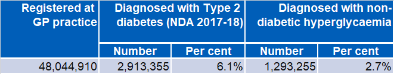

## Slide 4

### NHS Diabetes Prevention Programme

The GP record data shows that 

160,475 people are offered attendance on a prevention course. 

57,180 of these people decline the offer.

4

Table 2: Offers for DPP behavioural change courses1,2, non-diabetic hyperglycaemia, 2017-18, England

Referrals to – and attendances at – DPP behavioural change courses are sometimes recorded in GP records, but the data is not complete. 

### Invitation to attend and uptake of offer

Future plans

Once data from the Diabetes Prevention Programme providers has been linked to the GP data that forms the basis of this report, a more complete picture of referrals and attendance will be available.

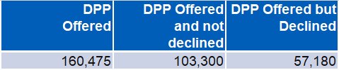

| Notes: |
| --- |
| 1. People included: All ages |
| 2. People included: registered at a GP practice that participated in NDA 2017-18. |

## Slide 5

### People with Non-Diabetic Hyperglycaemia<br><br>Demographics

5

## Slide 6

### Non-Diabetic Hyperglycaemia: Age / Sex

6

Figure 1: Age distribution2,3, by sex, non-diabetic hyperglycaemia \(NDH\), Type 2 diabetes4 \(T2DM\) and England1 \(ONS mid-2017 estimates\), 2017-18, England

The non-diabetic hyperglycaemia population and the Type 2 diabetes population are similar to one another, though a higher proportion of men have Type 2 diabetes. 

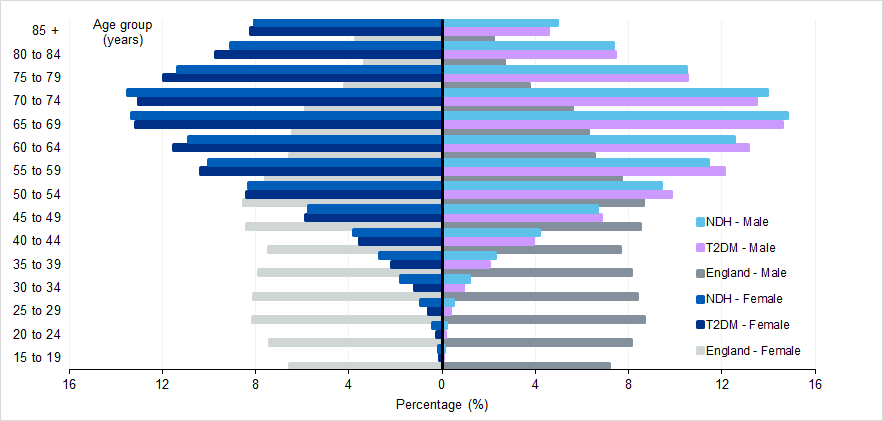
Figure 1: Age distribution2,3, by sex, non-diabetic hyperglycaemia \(NDH\), Type 2 diabetes4 \(T2DM\) and England1 \(ONS mid-2017 estimates\), 2017-18, England

Both populations are markedly older than the general population.

| Notes: |
| --- |
| 1. Data taken from ONS '[Estimates of the population for the UK, England and Wales, Scotland and Northern Ireland](https://www.ons.gov.uk/peoplepopulationandcommunity/populationandmigration/populationestimates/datasets/populationestimatesforukenglandandwalesscotlandandnorthernireland)' for mid-2017. |
| 2. People included: those who are aged 15 years and over \(with a known, valid date of birth\). |
| 3. People included \(NDH, T2DM\): registered at a GP practice that participated in NDA 2017-18. |
| 4. People included \(T2DM\): those in NDA 2017-18 who did not have type 1 diabetes. |

## Slide 7

### Non-Diabetic Hyperglycaemia: Ethnicity

7

Table 3: Registrations1,2, by ethnicity3, non-diabetic hyperglycaemia, 2017-18, England

15.4% of people recordedwith non-diabetic hyperglycaemia are known to be from black, Asian and ethnic

minority groups 

\(BAME\)

| Registrations | Ethnicity | White | Asian | Black | Mixed | Other | Unknown |
| --- | --- | --- | --- | --- | --- | --- | --- |
|  | Number | 867,940 | 125,800 | 47,360 | 12,980 | 12,470 | 227,945 |
|  | Percent | 67.0 | 9.7 | 3.7 | 1.0 | 1.0 | 17.6 |

BAME people with non-diabetic hyperglycaemia have a lower age distribution than white people.

 \(next slide\)

| Category | Value |
| --- | --- |
| White | 67 |
| BAME | 15.4 |
| Unknown | 17.600000000000001 |

```text
[PPTX decorative shape omitted: Arrow: Bent 3]
```

| Notes: |
| --- |
| 1. People included: All ages |
| 2. People included: registered at a GP practice that participated in NDA 2017-18. |
| 3. 'Unknown' includes people where the ethnicity was Unknown or Not Stated. |

## Slide 8

### Non-Diabetic Hyperglycaemia: Age / Ethnicity

8

Figure 2: Age distribution2,3, by ethnicity, nondiabetic hyperglycaemia \(NDH\), Type 2 diabetes4 \(T2DM\) and England1 \(Census 2011\), 2017-18, England

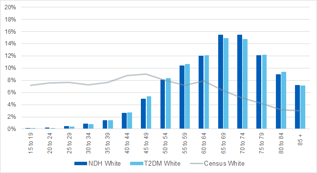
Figure 2: Age distribution2,3, by ethnicity, nondiabetic hyperglycaemia \(NDH\), Type 2 diabetes4 \(T2DM\) and England1 \(Census 2011\), 2017-18, England

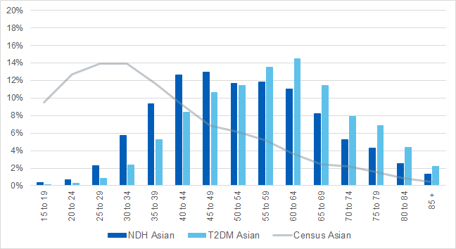

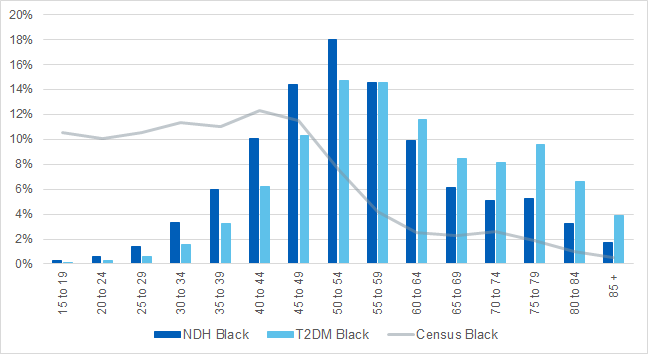

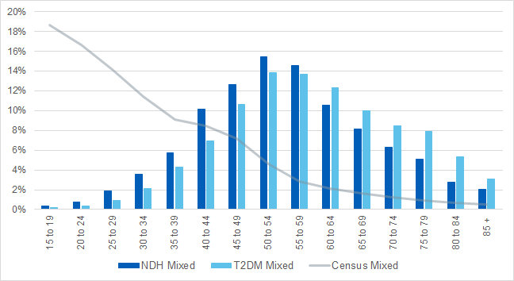

Notes: 1. Data taken from ONS, [2011 Census](https://www.nomisweb.co.uk/query/construct/summary.asp?reset=yes&amp;mode=construct&amp;dataset=651&amp;version=0&amp;anal=1&amp;initsel=)). 2. People included: those who are aged 15 years and over \(with a known, valid date of birth\). 

3. People included \(NDH, T2DM\): registered at a GP practice that participated in NDA 2017-18. 

4. People included \(T2DM\): those in NDA 2017-18 who did not have type 1 diabetes.

## Slide 9

### Non-Diabetic Hyperglycaemia: Deprivation

9

Figure 3: Deprivation breakdown1,2 \(quintiles\), non-diabetic hyperglycaemia \(NDH\), Type 2 diabetes3 \(T2DM\) and England, 2017-18, England

People with type 2 diabetes are more often found in more deprived areas: there is a clear decrease from the most to least deprived quintiles.

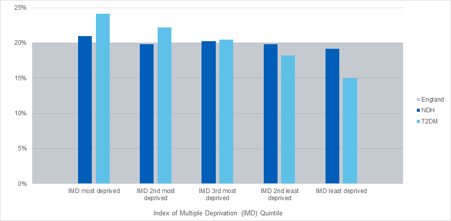
Figure 3: Deprivation breakdown1,2 \(quintiles\), non-diabetic hyperglycaemia \(NDH\), Type 2 diabetes3 \(T2DM\) and England, 2017-18, England

People with non-diabetic hyperglycaemia are found in similar numbers across deprivation quintiles: there is only a slight gradient change from most to least deprived.


Notes: 

1. People included: All ages

2. People included \(NDH, T2DM\): registered at a GP practice that participated in NDA 2017-18. 

3. People included \(T2DM\): those in NDA 2017-18 who did not have type 1 diabetes.

## Slide 10

### Non-Diabetic Hyperglycaemia: BMI

10

Figure 4: Body Mass Index1,2 \(BMI\), non-diabetic hyperglycaemia \(NDH\), Type 2 diabetes3 \(T2DM\), 2017-18, England

The distribution of normal, overweight and obese BMI is similar amongst people with non-diabetic hyperglycaemia and people with Type 2 diabetes. The proportion of people in the ‘healthy’ weight category \(BMI \< 25\) is slightly higher in the NDH population than in the Type 2 diabetes population.

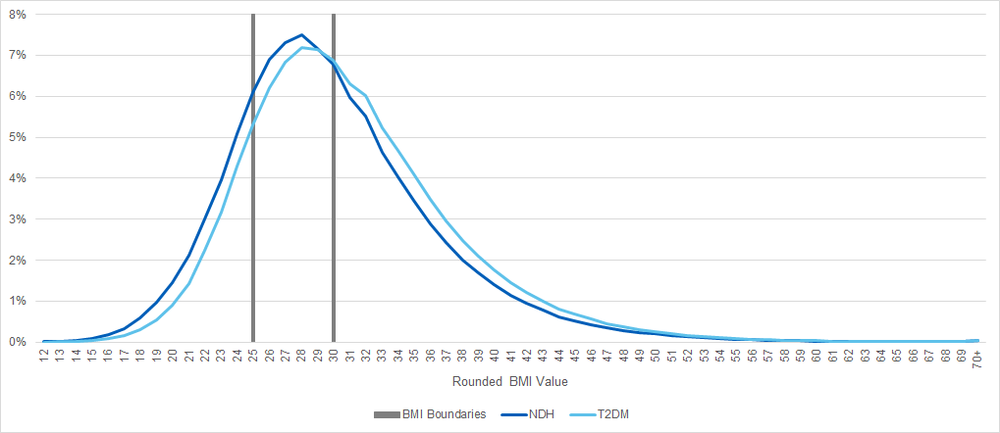

BMI less than 18.5 – underweight

BMI 18.5 to less than 25 – normal

BMI 25 to less than 30 – overweight

BMI 30 or more – obese

Notes: 

1. People included: All ages

2. People included \(NDH, T2DM\): registered at a GP practice that participated in NDA 2017-18. 

3. People included \(T2DM\): those in NDA 2017-18 who did not have type 1 diabetes.

## Slide 11

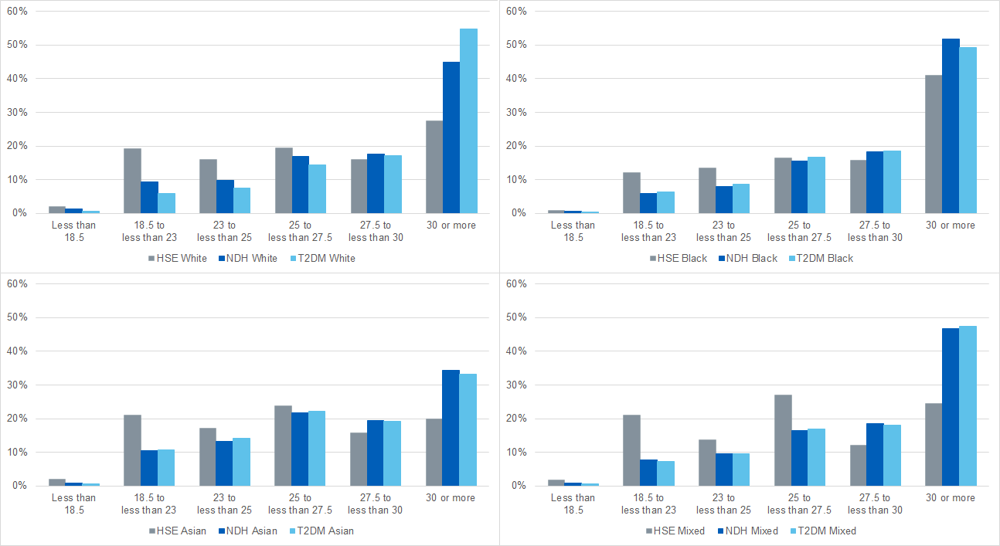

### Non-Diabetic Hyperglycaemia: BMI / Ethnicity

11

Figure 5: Body Mass Index2,3 \(BMI\), by ethnicity, non-diabetic hyperglycaemia \(NDH\), Type 2 diabetes4 \(T2DM\) and England1,5 \(Health Survey for England 2015-17\), 2017-18, England

1.A lesser proportion of White people with NDH or Type 2 DM have a BMI in the normal range, compared to all White people.

```text
[PPTX connector omitted: Straight Arrow Connector 7]
```

```text
[PPTX connector omitted: Straight Arrow Connector 9]
```

2. Compared to all White people, a greater proportion of those with NDH are obese. An even greater proportion of those with T2DM are obese.

```text
[PPTX connector omitted: Straight Arrow Connector 12]
```

3. Black people with NDH and Type 2 DM show a similar distribution across BMI groups.

4. Compared to all Black people, a greater proportion of those with NDH and Type 2 DM are obese.

```text
[PPTX connector omitted: Straight Arrow Connector 18]
```

5. Compared to all Asian people, those with NDH or Type 2 DM are more likely to be obese, but this is less pronounced than for other ethnic groups.

6. The Mixed ethnic group also has a greater proportion of people with an obese BMI, and a lesser proportion with a normal BMI, if people have NDH or Type 2 DM, compared to all people in the ethnic group.

```text
[PPTX connector omitted: Straight Arrow Connector 23]
```

```text
[PPTX connector omitted: Straight Arrow Connector 25]
```

```text
[PPTX connector omitted: Straight Arrow Connector 27]
```

BMI less than 18.5 – underweight BMI 18.5 to less than 25 – normal

BMI 25 to less than 30 – overweight BMI 30 or more – obese

Notes: 1. Data taken from Health Survey for England, 2017: [Adult and Child overweight and obesity](https://files.digital.nhs.uk/C5/A91FA6/HSE17-Adult-Child-BMI-tab.xlsx). 2. People included: All ages 

3. People included \(NDH, T2DM\): registered at a GP practice that participated in NDA 2017-18. 4. People included \(T2DM\): those who did not have type 1 diabetes. 5. People included \(from Health Survey for England\): aged 16 years and over with height / weight measurements \(age-standardised\). 

## Slide 12

### Impact of Behaviour Change Programmes<br>

12

## Slide 13

### Current limitations and future plans

There is not yet sufficient data to make an assessment on whether the behaviour change programmes are having an impact on reducing weight, progression to Type 2 Diabetes and other cardiovascular risk factors.

13

The GP data will be linked to the behaviour change programme provider data at person level in order to investigate the full journey of diagnosis through education and subsequent outcomes.

Future plans


This will be investigated in future reports on the Diabetes Prevention Programme.


## Slide 14

|  <br>  | The Healthcare Quality Improvement Partnership \(HQIP\). The National Diabetes Audit \(NDA\) is part of the National Clinical Audit and Patient Outcomes Programme \(NCAPOP\) which is commissioned by the Healthcare Quality Improvement Partnership \(HQIP\) and funded by NHS England. HQIP is led by a consortium of the Academy of Medical Royal Colleges, the Royal College of Nursing and National Voices. Its aim is to promote quality improvement, and in particular to increase the impact that clinical audit has on healthcare quality in England and Wales. HQIP holds the contract to manage and develop the NCAPOP Programme, comprising more than 30 clinical audits that cover care provided to people with a wide range of medical, surgical and mental health conditions. The programme is funded by NHS England, the Welsh Government and, with some individual audits, also funded by the Health Department of the Scottish Government, DHSSPS Northern Ireland and the Channel Islands. |
| --- | --- |
|  <br>  | NHS Digital is the trading name for the Health and Social Care Information Centre \(HSCIC\). NHS Digital managed the publication of the 2017-18 annual report. |
|  <br>  | Diabetes UK is the charity leading the fight against the most devastating and fastest growing health crisis of our time, creating a world where diabetes can do no harm. |

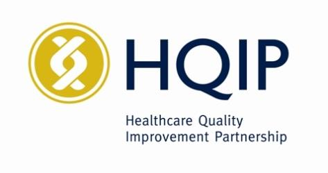

|  <br>  | The National Cardiovascular Intelligence Network \(NCVIN\) is a partnership of leading national cardiovascular organisations which analyses information and data and turns it into meaningful timely health intelligence for commissioners, policy makers, clinicians and health professionals to improve services and outcomes. |
| --- | --- |

```text
[PPTX decorative shape omitted: Rectangle 10]
```

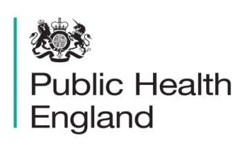


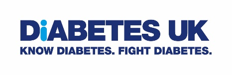

14

### Diabetes Prevention Programme, 2017-18

## Slide 15

### Diabetes Prevention Programme, 2017-18

Published by NHS Digital

Part of the Government Statistical Service

Responsible Statistician

Peter Knighton, Principal Information Analyst

For further information

[digital.nhs.uk](https://digital.nhs.uk/)

0300 303 5678

[enquiries@nhsdigital.nhs.uk](mailto:enquiries@nhsdigital.nhs.uk?subject=NPID%20Audit%20Report%202015)

Copyright © 2019, the Healthcare Quality Improvement Partnership, National Diabetes Audit. All rights reserved.

This work remains the sole and exclusive property of the Healthcare Quality Improvement Partnership and may only be reproduced where there is explicit reference to the ownership of the Healthcare Quality Improvement Partnership.

This work may be re-used by NHS and government organisations without permission.

15
